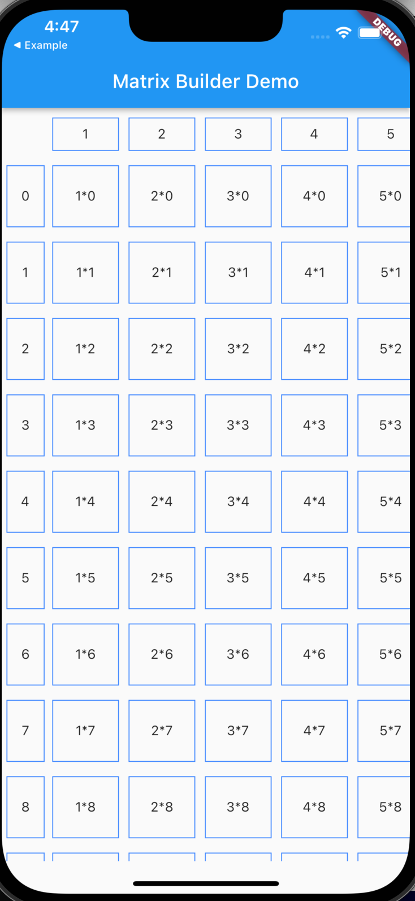

<!-- 
This README describes the package. If you publish this package to pub.dev,
this README's contents appear on the landing page for your package.

For information about how to write a good package README, see the guide for
[writing package pages](https://dart.dev/guides/libraries/writing-package-pages). 

For general information about developing packages, see the Dart guide for
[creating packages](https://dart.dev/guides/libraries/create-library-packages)
and the Flutter guide for
[developing packages and plugins](https://flutter.dev/developing-packages). 
-->

A Scrollable table for flutter with fixed row and column header.
Inspired by [Crizant Lai's post on Medium](https://medium.com/nerd-for-tech/flutter-creating-a-two-direction-scrolling-table-with-fixed-head-and-column-4a34fc01378f)

## Features
This package consist of 3 parts:
- Column Builder: Builds the leftmost fixed row header.
```
columnBuilder (BuildContext context, int column) {
            return Container(
            child: Text("Column Count: $column"),
         );
    }
```
- Header Builder: Builds the topmost fixed column header.
```
headBuilder: (BuildContext context, int row) {
            return Container(
            child:Text("Row Count: row"),
            );

          }
```
- Cell Builder: Build the cells for the matrix according to row and column length specified.
```
cellBuilder: (BuildContext context, int row, int column) {
            return Container(
            child:Text("$row*$column")
            );
          }
```


 &nbsp;


## Usage

This example creates a 10*10 grid, that is scrollable in both directions

```dart
class MyExampleApp extends StatelessWidget {
  const MyExampleApp({Key? key}) : super(key: key);

  @override
  Widget build(BuildContext context) {
    return Scaffold(
      appBar: AppBar(
        title: const Text("Matrix Builder Demo"),
      ),
      body: SafeArea(
        child: MatrixBuilder(
          columnBuilder: (BuildContext context, int column) {
            return Container(
              child: Text("Column Count $column"),
            );
          },
          cellBuilder: (BuildContext context, int row, int column) {
            return box("$row*$column");
          },
          headBuilder: (BuildContext context, int row) {
            return box("$row");
          },
          rowCount: 10,
          columnCount: 10,
        ),
      ),
    );
  }

  Widget box(String text) => Container(
        child: Center(child: Text(text)),
        decoration: BoxDecoration(
          border: Border.all(color: Colors.blueAccent),
        ),
        margin: const EdgeInsets.only(left: 5, right: 5, top: 10, bottom: 5),
        height: 70,
        width: 70,
      );
}
```


